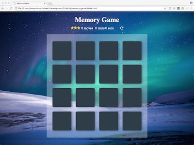
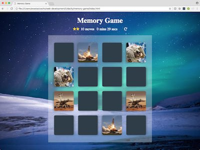

# Memory Game

I created this game for the purposes of the [Udacity's Front-End Web Developer Nanodegree Program](https://www.udacity.com/course/front-end-web-developer-nanodegree--nd001) to showcase my HTML, CSS and JavaScript skills.

## How to Load the game

- Clone the **[repo](https://github.com/anastasioscho/memory-game.git)** and open index.html.

### How The Game Works

The game board consists of sixteen "cards" arranged in a grid. The deck is made up of eight different pairs of cards, each with different images on one side. The cards are arranged randomly on the grid with the image face down. The gameplay rules are very simple: flip over two hidden cards at a time to locate the ones that match!

Each turn:

- The player flips one card over to reveal its underlying image.
- The player then turns over a second card, trying to find the corresponding card with the same image.
- If the cards match, both cards stay flipped over.
- If the cards do not match, both cards are flipped face down.
- The game ends once all cards have been correctly matched.

### Screenshots

  

## Resources

### Shuffle an array in JavaScript

- <http://stackoverflow.com/a/2450976>

## CSS Animations

- <http://animista.net/>
- <https://css-tricks.com/snippets/css/keyframe-animation-syntax/>
- <https://desandro.github.io/3dtransforms/docs/card-flip.html>
- <https://davidwalsh.name/css-flip>

### Modal

- <https://sabe.io/tutorials/how-to-create-modal-popup-box>

### Images

- <https://www.pexels.com/>
